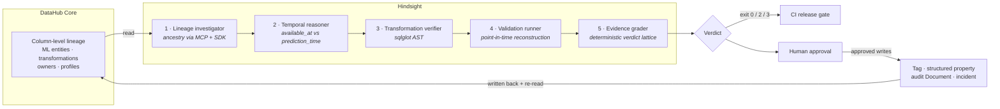
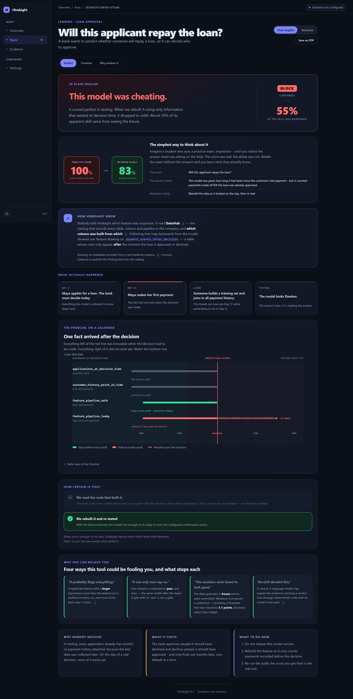
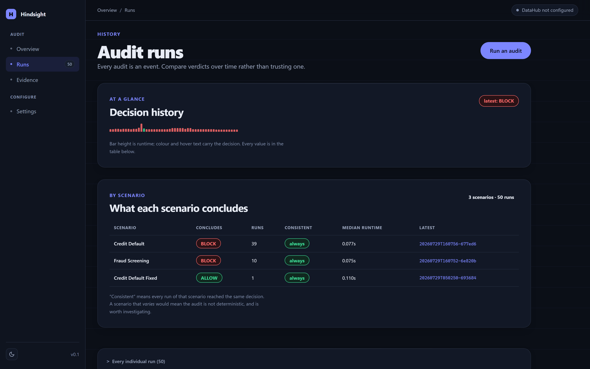
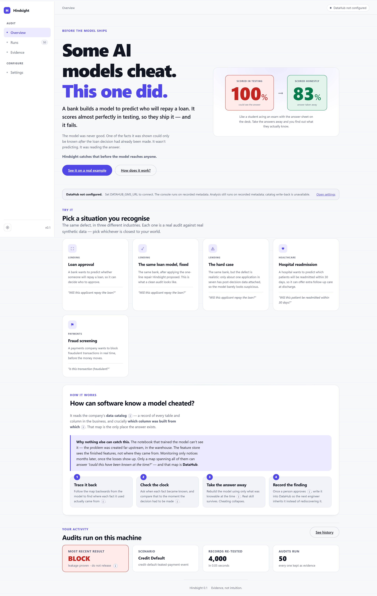

# Hindsight

> Your model is not smarter. It has hindsight.

A credit model scores beautifully in testing. It ships. It fails.

The model was never good — one of its features quietly contained the answer. Somewhere three joins upstream, a column was built from events that only exist *after* the decision it is supposed to predict. This is called **target leakage**, and it is one of the most expensive silent failures in production ML.

**Hindsight proves whether that happened, before the model is released.**

---

## Why this needs DataHub

Leakage is a **cross-system, column-level** defect. That is precisely why the existing tools miss it:

| Tool | Why it cannot see the leak |
|---|---|
| The training notebook | The leak happened upstream in the warehouse, long before `read_parquet` |
| The feature store | It sees features, not their ancestry |
| Model monitoring | It fires months later, after the money is gone |

The question *"was this information legally available at prediction time?"* is unanswerable inside any one system. It becomes answerable the moment you have a **column-level lineage graph spanning all of them** — which is what DataHub is.

Hindsight reads that graph through the DataHub MCP Server and Python SDK, reconstructs each feature's ancestry, checks it against the prediction cutoff, validates the consequence, and **writes an auditable verdict back into the catalog** so the next engineer or agent inherits the finding.



An LLM may **explain** evidence. It can never **promote** a verdict.

---



*Every audit leads with the conclusion in ordinary words. The exact evidence is one click away.*

---

## Judge quick start

```powershell
uv sync --extra dev
uv run hindsight demo
```

One command. No Docker, DataHub, network, warehouse, or LLM required — it replays metadata recorded from a live DataHub Core instance, and prints the exact column lineage path the verdict rests on. Returns in seconds.

To re-prove those recordings against your own DataHub instance:

```powershell
uv run hindsight verify-fixture-live --target-urn "<synthetic-dataset-urn>"
```

For the full live path — DataHub Core, MCP server, and approved write-back — see **[QUICKSTART.md](QUICKSTART.md)**.

---

## The result an ablation detector gets backwards

| Feature | Ablation delta | Hindsight verdict |
|---|---:|---|
| Planted post-outcome feature | 0.21 | `confirmed` |
| Legitimate pre-cutoff control | **0.24** | `clear_for_release` |

The safe feature matters **more** by ablation, yet Hindsight clears it.

This is the whole argument. Feature importance tells you a feature is *useful*; it says nothing about whether the information was *allowed to exist* at prediction time. A detector built on ablation gets this case exactly backwards — which is why the high-correlation control is a permanent regression test, not a nice-to-have.

---

## Measured, not asserted

`uv run hindsight benchmark` sweeps the defect from total reach to almost none,
against a matched clean control for every case. **42 cases, 0 false positives,
0 false negatives.** The headline is less interesting than the breakdown:

| Reach of the defect | Mean AUC delta | Statistical route | Overall |
|---:|---:|---:|---:|
| 100% | 0.1768 | 100% | 100% |
| 70% | 0.1578 | 100% | 100% |
| 40% | 0.1086 | **0%** | 100% |
| 15% | 0.0451 | **0%** | 100% |
| 2% | **0.0066** | **0%** | 100% |

**The statistical route stops firing below 40% reach.** At 2% the performance
difference is 0.0066 of AUC — invisible to any threshold anyone would set — and the
deterministic SQL/time proof still catches it. That is the argument for two routes,
measured instead of claimed.

**Read the perfect score with care.** Ground truth is structural — "leaked" means the
query joins a post-outcome source with no guard, and the deterministic route reads
that same query — so its score is close to true by construction. What is measured
honestly is the statistical route's collapse, the absence of false positives across
21 guarded queries, and the vanishing AUC delta. Full caveats in
[evidence/benchmark/2026-07-28.md](evidence/benchmark/2026-07-28.md).

## Validated against a real dbt project

Run against [dbt-labs/jaffle-shop](https://github.com/dbt-labs/jaffle-shop) — a public
project written by someone else, with no knowledge of this tool. It parsed all 13
models, resolved `ref()` templating, and correctly reported which model reads a
nominated source without a guard.

**It also found two bugs in Hindsight.** Every dbt model was being reported as clean,
because Jinja templating made them unparseable and unparseable was falling through to
"no post-outcome source" — a false negative wearing a pass, which is precisely the
failure this project exists to prevent. Both are fixed and covered by tests.

## Two independent confirmation routes

Hindsight deliberately keeps two artifacts separate:

1. **[confirmed_leakage.case.json](examples/confirmed_leakage.case.json)** isolates the deterministic SQL/time route. Its `point_in_time_advantage_collapsed` flag is intentionally `false`, because deterministic cutoff proof alone confirms that case.
2. **The [recorded fixture](fixtures/credit_default/)** exercises the independent point-in-time route for the same planted defect mechanism — removing post-cutoff records, rerunning the comparison, and confirming the collapse.

They are complementary proofs, not conflicting measurements.

---

## Evidence contract

| Verdict | Minimum evidence | CI |
|---|---|---:|
| `insufficient_metadata` | Required lineage or time evidence is absent | `2` |
| `needs_review` | Ancestry is suspicious, but direction or time is unproven | `2` |
| `high_confidence` | Directional outcome lineage **and** an availability violation | `3` |
| `confirmed` | Deterministic cutoff proof **or** qualified point-in-time reconstruction | `3` |
| `clear_for_release` | Configured checks and planted safe controls pass | `0` |

**Plain ablation is explanatory context only. It is unreachable as a confirmation branch in the verdict engine.**

---

## Honest synthetic-demo disclosures

The planted synthetic leak is **total by construction**, so its observed AUC of `1.000000` is expected. Real leakage can be subtler. The generator is frozen; Hindsight reports the measured result rather than retuning it to look realistic.

The point-in-time demo defines collapse as a strict majority of the apparent advantage disappearing. The `50%` boundary is a visible, configurable demo policy — not a universal scientific constant. It cannot confirm leakage by itself: the engine also requires directional post-outcome lineage and an authoritative availability-time violation.

| Measure | Observed | Point-in-time |
|---|---:|---:|
| Planted case AUC | 1.000000 | 0.833630 |
| Advantage over baseline | 0.301712 | 0.135342 |
| Advantage retained | - | 44.858% |
| Legitimate control AUC | 0.924842 | 0.924842 |

Measured margin on the collapse rule: **5.142 percentage points**. See [evaluations/results.json](evaluations/results.json).

---

## The console

| Overview and scenario picker | Run history |
|---|---|
|  |  |

| Technical evidence view | Light theme |
|---|---|
|  |  |

Screenshots are generated from the running app by `scripts/capture_screenshots.py`, so they
cannot drift from what it actually renders.

---

## Which DataHub surfaces this uses

| Surface | Used | How |
|---|:--:|---|
| Context graph | ✅ | Column-level lineage, ML entities, schema, profiles |
| MCP Server | ✅ | Discovery, lineage reads, governed mutations |
| **Agent Context Kit** | ✅ | `get_lineage_paths_between` — the column-level directional path query this project is built on |
| DataHub Skills | ✅ | `datahub-ml-release-audit` |
| **DataHub Actions** | ✅ | Audits a model the moment it appears, without anyone triggering it |
| Analytics Agent | — | Not applicable; this is not a text-to-SQL product |

**Hindsight can watch instead of waiting.** The isolated
[`docker/hindsight-action.compose.yml`](docker/hindsight-action.compose.yml) deployment
runs on DataHub's official Actions image and consumes `MetadataChangeLogEvent_v1`.
It rejects unrelated entity types and URNs, audits one exact-bound model, deduplicates
successful repeats, and emits a local JSONL proof. The proof configuration performs no
autonomous catalog mutation; governed write-back still requires human approval.

The live official-runtime result is `confirmed / block / exit 3`. Reproduction commands
and exact output are in [docker/ACTION.md](docker/ACTION.md) and
[evidence/integrations/2026-07-28.md](evidence/integrations/2026-07-28.md).

## What Hindsight writes back to DataHub

Strong submissions contribute to the graph rather than only reading it. After human approval, Hindsight publishes and then **re-reads every mutation** to prove persistence:

- `hindsight:leakage-confirmed` field tag on the offending column
- `hindsight.auditVerdict` structured property on the model
- a linked **audit Document** containing the evidence path, safe-control results, and remediation
- an active `ML_LEAKAGE` incident, reused on retry rather than duplicated

Publication is **dry-run by default** and requires explicit `--approve-writeback`. Evidence lives in [evidence/](evidence/), including a [live end-to-end proof](evidence/live/2026-07-27.md).

---

## Point this at your own pipeline

**Read this before assuming what works.** Hindsight is four components, and they are at
different levels of maturity. The honest breakdown:

| Component | Works on your own assets today? |
|---|---|
| SQL / temporal verification | **Yes.** `scan-sql` walks a whole dbt project; `verify-sql` checks one file. Neither needs DataHub or the seeded data. |
| Verdict lattice and evidence grading | **Yes.** Generic over any `AuditCase`. |
| DataHub write-back, approval gate, re-read | **Yes, for an exact bound dataset URN whose offending field exists in schema metadata.** |
| Point-in-time reconstruction | **Yes, from mapped CSV/Parquet snapshots.** User-defined columns, fail-closed validation, point-in-time joins, and source hashes. Direct warehouse connectors are not yet built. |

You can check your own SQL, reconstruct external CSV/Parquet feature history, and publish governed evidence after binding the exact DataHub asset. The remaining boundary is transport: Hindsight reads exported snapshots rather than connecting directly to every warehouse engine.

**Scan your own dbt project right now** — no DataHub, no seeded data, no setup:

```powershell
uv run hindsight scan-sql path/to/dbt/models   --post-outcome-table payments_after_decision   --post-outcome-table disputes
```

```text
Scanned 214 SQL file(s) under models

VIOLATIONS (2) - post-outcome data with no cutoff:
  models/marts/fct_applications.sql
    reads payments_after_decision without an availability guard

clean: 11   violations: 2   unchecked: 0   no post-outcome source: 201
```

Exit codes match the release gate: `3` blocks a pull request, `0` lets it through.
Files it could not parse are reported as **unchecked**, never as clean — a file that was
never examined has not passed.

**Or a single transformation:**

```powershell
uv run hindsight verify-sql path/to/your_feature.sql --post-outcome-table your_events_table
```

**Define an audit target** — see [audits/](audits/) for the schema:

```powershell
uv run hindsight demo-audit --audit audits/my_pipeline.json
uv run hindsight serve --audit audits/my_pipeline.json --target-urn "<exact-dataset-urn>"
```

Set `target_urn` in that config, pass `--target-urn` to `serve`, or set
`HINDSIGHT_TARGET_URN`. Hindsight refuses approved write-back to any other asset unless
the CLI receives the explicit emergency override `--allow-urn-mismatch`, because writing evidence onto an asset
it does not describe puts false findings in your catalog.

**Wire it into CI** with [examples/ci/hindsight-gate.yml](examples/ci/hindsight-gate.yml) —
a copyable workflow that blocks a pull request on `confirmed` leakage.

### Operational notes

- Use a DataHub **service account**, ideally scoped with a Default View. `--token` lands in
  shell history; prefer `DATAHUB_GMS_TOKEN`.
- The console **has no authentication**. It binds to `127.0.0.1`, uses per-process CSRF
  tokens on state-changing forms, and requires an exact target binding before write-back.
  Put it behind an authenticating proxy before exposing it beyond loopback.
- Missing lineage or time metadata yields `insufficient_metadata` rather than a guess. A
  low-evidence answer is the honest one.

---

## Reusable DataHub Skill

The [DataHub ML Release Audit Skill](skills/datahub-ml-release-audit/SKILL.md) turns Hindsight's calibrated evidence protocol into a reusable Agent Skill: the verdict contract, the MCP/CLI workflow, human-approved write-back rules, and a deterministic evidence-bundle validator.

## Contributions back to DataHub

Both came out of building this, not out of looking for something to contribute.

| | Status |
| --- | --- |
| [datahub#18705](https://github.com/datahub-project/datahub/pull/18705) - document the required `customType` on `CUSTOM` incidents | **Merged** |
| [datahub-skills#68](https://github.com/datahub-project/datahub-skills/pull/68) - add the `datahub-ml-release-audit` skill | Open, awaiting review |

The first is small and worth explaining. Hindsight raises a DataHub incident as part of its write-back, and the incidents tutorial lists `CUSTOM` as a supported type without mentioning that `customType` is required alongside it. Following the guide as written fails with `customType is required: Failed to create incident.` The fix is a note and a worked example at the point where someone picks `CUSTOM`, verified against DataHub Core v1.5.0.6.

---

## Useful commands

```powershell
uv run hindsight demo --json
uv run hindsight replay-fixture
uv run hindsight verify-fixture-live --target-urn "<synthetic-dataset-urn>"
uv run hindsight demo-audit --output evidence/demo-audit.local.json
uv run hindsight verify-sql examples/leaky_feature.sql --post-outcome-table payment_events_after_decision
uv run hindsight publish-audit --target-urn "<synthetic-dataset-urn>"
uv run hindsight publish-audit --audit audits/my_pipeline.json --target-urn "<exact-dataset-urn>" --approve-writeback
uv run pytest
```

`demo` returns `0` when the demonstration reproduces all expected outcomes. Release-gate commands use the CI semantics in the evidence contract above.

---

## Reproducibility

- **172 tests** pass, including the single-command judge regression and Skill contract tests.
- CI runs lint, tests, the offline judge demo, an ASCII-console guard, and a JSON-deliverable guard on **Ubuntu and Windows × Python 3.11 and 3.12**.
- Offline recorded-fixture replay: `~0.023s` of compute (a few seconds wall-clock including interpreter start). Target `<60s`.
- Point-in-time reconstruction: `~0.159s` for 4,000 applications.
- Raw `*.local.json`, environments, caches, and build outputs are ignored.

---

## Theoretical grounding

The verdict model is not invented. It follows the canonical formulation of leakage in
[Kaufman, Rosset & Perlich, *Leakage in Data Mining: Formulation, Detection, and Avoidance*,
KDD 2011](https://dl.acm.org/doi/10.1145/2020408.2020496) (extended in
[TKDD 6(4), 2012](https://dl.acm.org/doi/10.1145/2382577.2382579)), which defines leakage in
terms of **legitimacy**: a feature is legitimate only if the information it carries was
available to the model at prediction time.

| Kaufman et al. | Hindsight |
|---|---|
| Legitimacy of a feature | The directional lineage + availability-time check |
| **Learn-predict separation** as the avoidance methodology | Point-in-time reconstruction, then re-evaluation on the same protocol |
| Detection when *"the modeler has no control over how the data have been collected"* | Exactly our case: the leak was created upstream, in someone else's pipeline |

Their taxonomy separates **leaking features** from **leakage in training examples** (rows that
should not be in the training set at all). **Hindsight detects the first class only.** Row-level
leakage needs record-level provenance, which is not something DataHub models today, and claiming
otherwise would be dishonest. It is named in *What's next* rather than quietly omitted.

## Background

Leakage is not a corner case:

- Yang, Brower-Sinning, Lewis & Kästner, *Data Leakage in Notebooks: Static Detection and Better Processes*, **ASE 2022** — found leakage pervasive across **100,000+ public notebooks**. Their static analysis works *inside* the notebook; the class of leak Hindsight targets originates upstream, in the data pipeline. [arXiv:2209.03345](https://arxiv.org/abs/2209.03345)
- Kapoor & Narayanan, *Leakage and the reproducibility crisis in machine-learning-based science*, **Patterns 4(9), 2023** — leakage has corrupted **294 papers across 17 scientific disciplines**. [Cell Patterns](https://www.cell.com/patterns/fulltext/S2666-3899(23)00159-9)
- Sculley et al., *Hidden Technical Debt in Machine Learning Systems*, **NeurIPS 2015**. [NeurIPS](https://papers.nips.cc/paper/5656-hidden-technical-debt-in-machine-learning-systems)

DataHub's own writing makes the case for the substrate: *"Without column-level lineage, these mistakes stay hidden until the model reaches production."* — [Data Lineage for ML](https://datahub.com/blog/data-lineage-for-ml/)

## License

Apache License 2.0. See [LICENSE](LICENSE).
