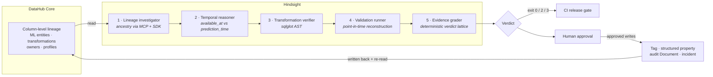

# Hindsight

> Your model is not smarter. It has hindsight.

A credit model scores beautifully in testing. It ships. It fails.

The model was never good — one of its features quietly contained the answer. Somewhere three joins upstream, a column was built from events that only exist *after* the decision it is supposed to predict. This is called **target leakage**, and it is one of the most expensive silent failures in production ML.

**Hindsight proves whether that happened, before the model is released.**

---

## Why this needs DataHub

Leakage is a **cross-system, column-level** defect. That is precisely why the existing tools miss it:

| Tool | Why it cannot see the leak |
|---|---|
| The training notebook | The leak happened upstream in the warehouse, long before `read_parquet` |
| The feature store | It sees features, not their ancestry |
| Model monitoring | It fires months later, after the money is gone |

The question *"was this information legally available at prediction time?"* is unanswerable inside any one system. It becomes answerable the moment you have a **column-level lineage graph spanning all of them** — which is what DataHub is.

Hindsight reads that graph through the DataHub MCP Server and Python SDK, reconstructs each feature's ancestry, checks it against the prediction cutoff, validates the consequence, and **writes an auditable verdict back into the catalog** so the next engineer or agent inherits the finding.



An LLM may **explain** evidence. It can never **promote** a verdict.

---

## Judge quick start

```powershell
uv sync --extra dev
uv run hindsight demo
```

One command. No Docker, DataHub, network, warehouse, or LLM required — it replays metadata recorded from a live DataHub Core instance, and prints the exact column lineage path the verdict rests on. Returns in seconds.

To re-prove those recordings against your own DataHub instance:

```powershell
uv run hindsight verify-fixture-live
```

For the full live path — DataHub Core, MCP server, and approved write-back — see **[QUICKSTART.md](QUICKSTART.md)**.

---

## The result an ablation detector gets backwards

| Feature | Ablation delta | Hindsight verdict |
|---|---:|---|
| Planted post-outcome feature | 0.21 | `confirmed` |
| Legitimate pre-cutoff control | **0.24** | `clear_for_release` |

The safe feature matters **more** by ablation, yet Hindsight clears it.

This is the whole argument. Feature importance tells you a feature is *useful*; it says nothing about whether the information was *allowed to exist* at prediction time. A detector built on ablation gets this case exactly backwards — which is why the high-correlation control is a permanent regression test, not a nice-to-have.

---

## Two independent confirmation routes

Hindsight deliberately keeps two artifacts separate:

1. **[confirmed_leakage.case.json](examples/confirmed_leakage.case.json)** isolates the deterministic SQL/time route. Its `point_in_time_advantage_collapsed` flag is intentionally `false`, because deterministic cutoff proof alone confirms that case.
2. **The [recorded fixture](fixtures/credit_default/)** exercises the independent point-in-time route for the same planted defect mechanism — removing post-cutoff records, rerunning the comparison, and confirming the collapse.

They are complementary proofs, not conflicting measurements.

---

## Evidence contract

| Verdict | Minimum evidence | CI |
|---|---|---:|
| `insufficient_metadata` | Required lineage or time evidence is absent | `2` |
| `needs_review` | Ancestry is suspicious, but direction or time is unproven | `2` |
| `high_confidence` | Directional outcome lineage **and** an availability violation | `3` |
| `confirmed` | Deterministic cutoff proof **or** qualified point-in-time reconstruction | `3` |
| `clear_for_release` | Configured checks and planted safe controls pass | `0` |

**Plain ablation is explanatory context only. It is unreachable as a confirmation branch in the verdict engine.**

---

## Honest synthetic-demo disclosures

The planted synthetic leak is **total by construction**, so its observed AUC of `1.000000` is expected. Real leakage can be subtler. The generator is frozen; Hindsight reports the measured result rather than retuning it to look realistic.

The point-in-time demo defines collapse as a strict majority of the apparent advantage disappearing. The `50%` boundary is a visible, configurable demo policy — not a universal scientific constant. It cannot confirm leakage by itself: the engine also requires directional post-outcome lineage and an authoritative availability-time violation.

| Measure | Observed | Point-in-time |
|---|---:|---:|
| Planted case AUC | 1.000000 | 0.833630 |
| Advantage over baseline | 0.301712 | 0.135342 |
| Advantage retained | - | 44.858% |
| Legitimate control AUC | 0.924842 | 0.924842 |

Measured margin on the collapse rule: **5.142 percentage points**. See [evaluations/results.json](evaluations/results.json).

---

## What Hindsight writes back to DataHub

Strong submissions contribute to the graph rather than only reading it. After human approval, Hindsight publishes and then **re-reads every mutation** to prove persistence:

- `hindsight:leakage-confirmed` field tag on the offending column
- `hindsight.auditVerdict` structured property on the model
- a linked **audit Document** containing the evidence path, safe-control results, and remediation
- an active `ML_LEAKAGE` incident, reused on retry rather than duplicated

Publication is **dry-run by default** and requires explicit `--approve-writeback`. Evidence lives in [evidence/](evidence/), including a [live end-to-end proof](evidence/live/2026-07-27.md).

---

## Point this at your own model

1. Configure DataHub — `DATAHUB_GMS_URL` and `DATAHUB_GMS_TOKEN`. Use a **service account**, ideally scoped with a Default View.
2. Ensure your feature datasets carry fine-grained column lineage and a time semantic (`event_time` / `available_at`). Hindsight returns `insufficient_metadata` rather than guessing when these are missing — a low-evidence answer is the honest one.
3. Audit a model version:
   ```powershell
   uv run hindsight demo-audit --output evidence/my-audit.local.json
   ```
4. Wire it into CI with **[examples/ci/hindsight-gate.yml](examples/ci/hindsight-gate.yml)** — a copyable workflow that blocks a pull request on `confirmed` leakage.

---

## Reusable DataHub Skill

The [DataHub ML Release Audit Skill](skills/datahub-ml-release-audit/SKILL.md) turns Hindsight's calibrated evidence protocol into a reusable Agent Skill: the verdict contract, the MCP/CLI workflow, human-approved write-back rules, and a deterministic evidence-bundle validator. The local contribution is tested; an upstream pull request is external work and is not claimed as complete here.

---

## Useful commands

```powershell
uv run hindsight demo --json
uv run hindsight replay-fixture
uv run hindsight verify-fixture-live
uv run hindsight demo-audit --output evidence/demo-audit.local.json
uv run hindsight verify-sql examples/leaky_feature.sql --post-outcome-table payment_events_after_decision
uv run hindsight publish-audit --target-urn "<synthetic-dataset-urn>"
uv run hindsight publish-audit --target-urn "<synthetic-dataset-urn>" --approve-writeback
uv run pytest
```

`demo` returns `0` when the demonstration reproduces all expected outcomes. Release-gate commands use the CI semantics in the evidence contract above.

---

## Reproducibility

- **29 tests** pass, including the single-command judge regression and Skill contract tests.
- CI runs lint, tests, the offline judge demo, an ASCII-console guard, and a JSON-deliverable guard on **Ubuntu and Windows × Python 3.11 and 3.12**.
- Offline recorded-fixture replay: `~0.023s` of compute (a few seconds wall-clock including interpreter start). Target `<60s`.
- Point-in-time reconstruction: `~0.159s` for 4,000 applications.
- Raw `*.local.json`, environments, caches, and build outputs are ignored.

---

## Background

Leakage is not a corner case:

- Yang, Brower-Sinning, Lewis & Kästner, *Data Leakage in Notebooks: Static Detection and Better Processes*, **ASE 2022** — found leakage pervasive across **100,000+ public notebooks**. Their static analysis works *inside* the notebook; the class of leak Hindsight targets originates upstream, in the data pipeline. [arXiv:2209.03345](https://arxiv.org/abs/2209.03345)
- Kapoor & Narayanan, *Leakage and the reproducibility crisis in machine-learning-based science*, **Patterns 4(9), 2023** — leakage has corrupted **294 papers across 17 scientific disciplines**. [Cell Patterns](https://www.cell.com/patterns/fulltext/S2666-3899(23)00159-9)
- Sculley et al., *Hidden Technical Debt in Machine Learning Systems*, **NeurIPS 2015**. [NeurIPS](https://papers.nips.cc/paper/5656-hidden-technical-debt-in-machine-learning-systems)

DataHub's own writing makes the case for the substrate: *"Without column-level lineage, these mistakes stay hidden until the model reaches production."* — [Data Lineage for ML](https://datahub.com/blog/data-lineage-for-ml/)

## License

Apache License 2.0. See [LICENSE](LICENSE).
